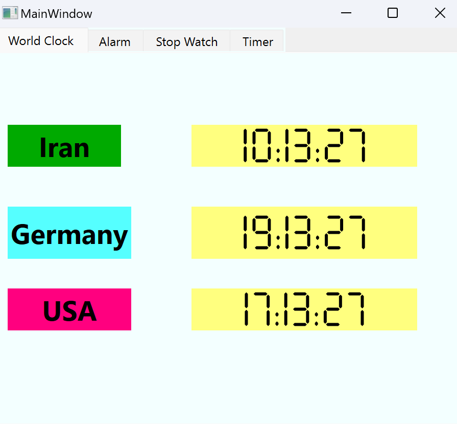
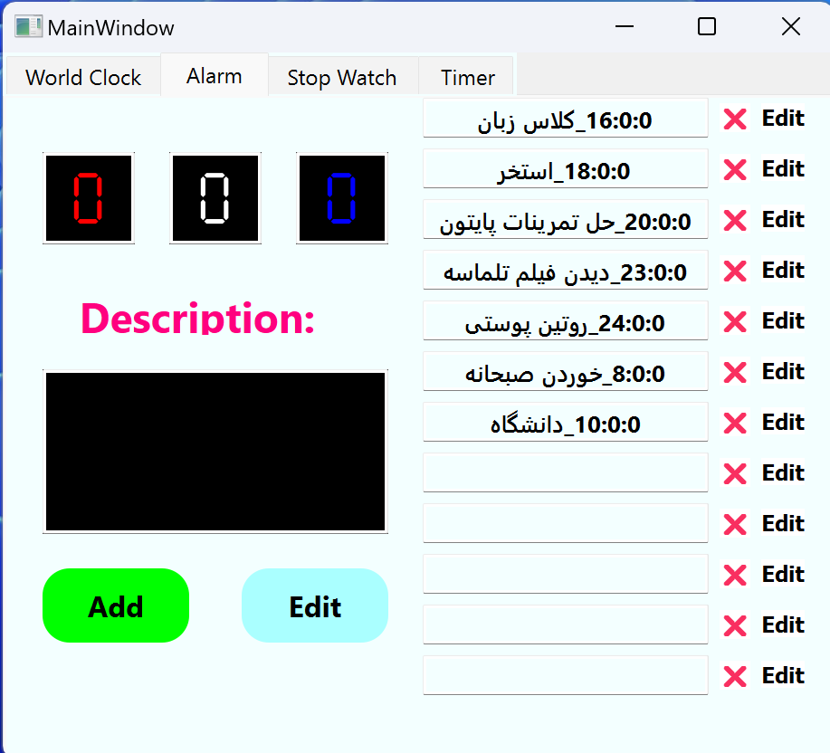
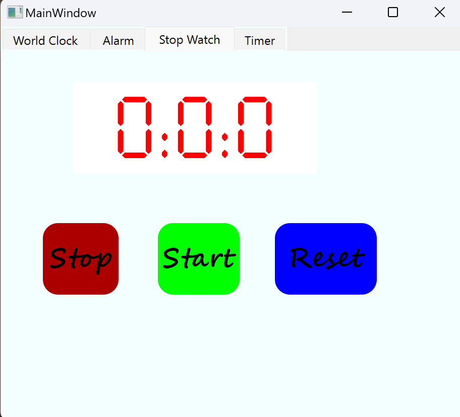
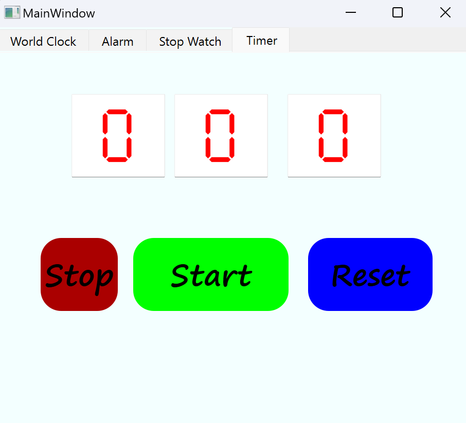

# Assigment 25

This Clock App contains 4 main sections:


# 🌏 World Clock

In this tab we can see the live time of 🇮🇷 Iran, 🇩🇪 Germany and 🇺🇸 USA



# ⏰ Alarm
In this tab we can read alarms from sqlite database and show in a list and 
➕ Add new alarm
📝 Edit alarm
❌ Remove alarm
and we can see notification at the alarm's time



# ⏱️ Stop Watch
we can Start, stop and reset a stop watch



# ⏲️ Timer
We can initialize a timer and start, stop and reset it. 
In addition we can see a notification at the end




>## How to Run
execute this command in terminal:
Run following command :
```
python main.py
```

>## How to install

To use the software, just run the ***dist/main.exe*** file